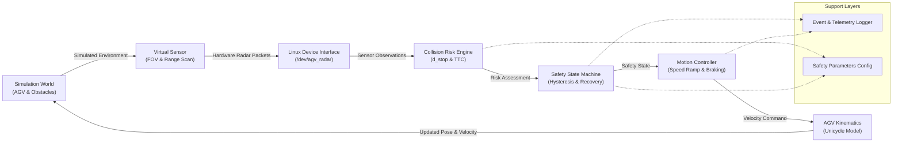
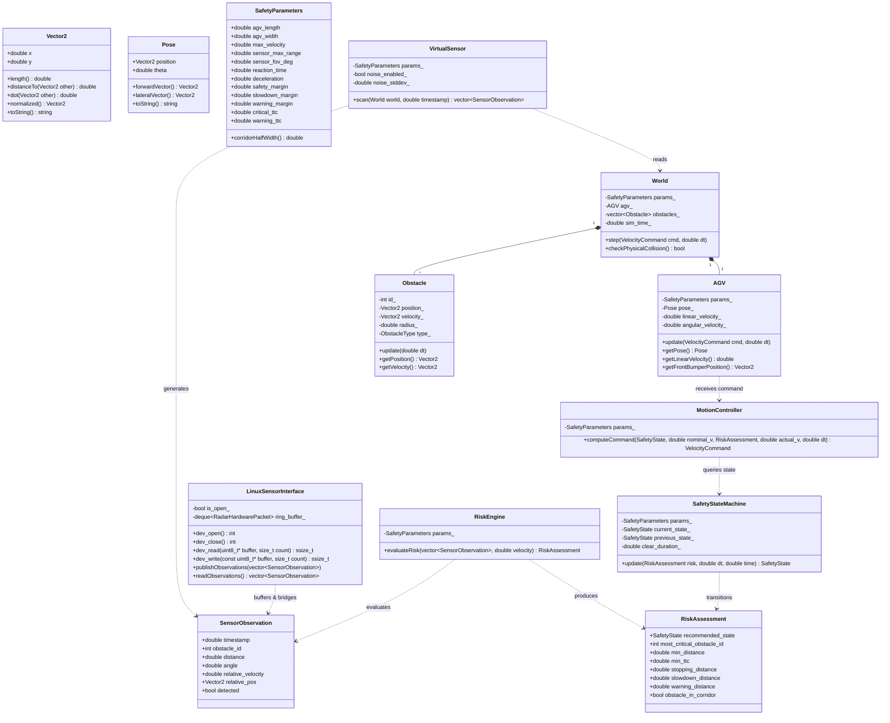
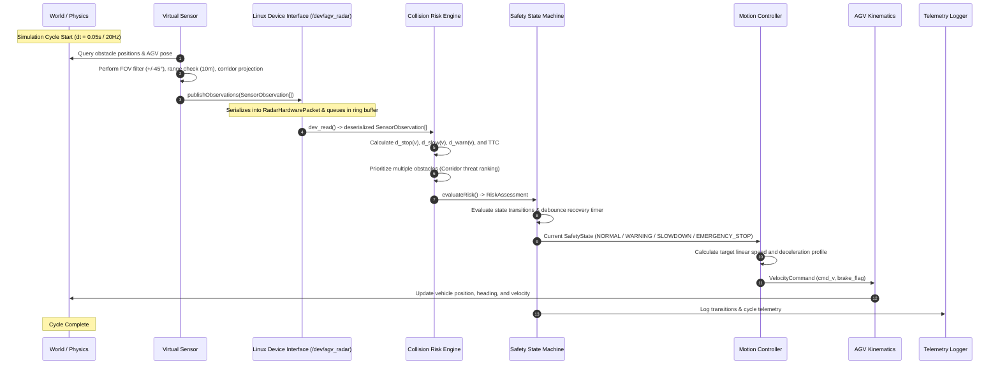
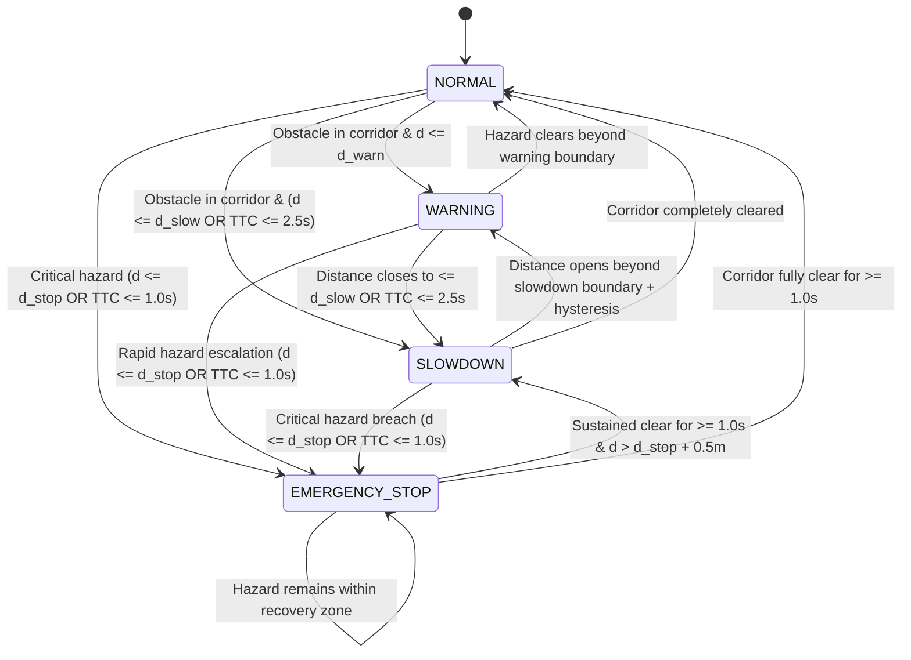

# AGV Collision-Avoidance Subsystem - Architecture & UML Design

This document details the software architecture, modular decomposition, data flow, and UML diagrams for the **AGV Collision-Avoidance Radar Subsystem**.

---

## 1. System Pipeline Overview



---

## 2. UML Class Diagram



---

## 3. UML Sequence Diagram (Single Simulation Control Cycle)



---

## 4. Safety State Machine Diagram



---

## 5. Linux Device Interface & System Abstraction

```
+------------------------------------------------------------------------+
|                      USER-SPACE APPLICATION LAYER                      |
|                                                                        |
|   +-----------------------+           +----------------------------+   |
|   | Collision Risk Engine | <-------- | Safety State Machine (FSM) |   |
|   +-----------------------+           +----------------------------+   |
|               ^                                                        |
|               |  std::vector<SensorObservation>                        |
|   +-----------------------+                                            |
|   | LinuxSensorInterface  |                                            |
|   +-----------------------+                                            |
+---------------|--------------------------------------------------------+
| POSIX API     |  dev_read() / dev_write() / dev_ioctl()                |
+---------------v--------------------------------------------------------+
|                   VIRTUAL CHARACTER DEVICE DRIVER                      |
|                           (/dev/agv_radar)                             |
|                                                                        |
|   +----------------------------------------------------------------+   |
|   |  Hardware Packet Ring Buffer (Mutex Protected, Max 1024 pkts)  |   |
|   |  - Magic: 0x52414452 ('RADR')                                  |   |
|   |  - 64-bit Timestamp (us)                                       |   |
|   |  - 32-bit Distance (mm), 16-bit Azimuth (mrad), Relative V     |   |
|   |  - 8-bit Detection Flag & XOR Checksum Verification            |   |
|   +----------------------------------------------------------------+   |
+------------------------------------------------------------------------+
```
